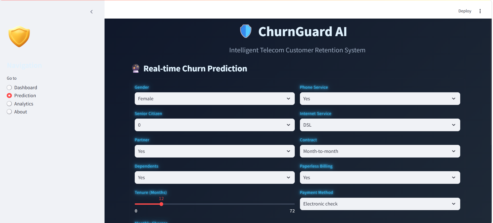

# Customer Churn Analysis & Prediction 🚀

<div align="center">


### End-to-End Customer Churn Analytics & Machine Learning Prediction System

</div>

---

# 📌 Project Overview

Customer churn is one of the biggest challenges for telecom, banking, SaaS, and subscription-based businesses.

This project focuses on:

✅ Understanding customer behavior  
✅ Identifying churn patterns  
✅ Finding key churn drivers  
✅ Building Machine Learning models to predict churn  
✅ Generating business insights & recommendations

The project combines:

- Data Cleaning
- Exploratory Data Analysis (EDA)
- Data Visualization
- Feature Engineering
- Machine Learning
- Business Intelligence

---

# 🎯 Business Problem

Companies lose significant revenue when customers leave their services.

The objective of this project is to:

- Predict whether a customer will churn or not
- Identify high-risk customers
- Reduce customer loss using data-driven strategies
- Improve retention and customer satisfaction

---

# 🛠️ Tech Stack

| Technology | Purpose |
|---|---|
| Python | Data Analysis & ML |
| Pandas | Data Cleaning |
| NumPy | Numerical Operations |
| Matplotlib | Data Visualization |
| Seaborn | Statistical Visualization |
| Scikit-Learn | Machine Learning |
| Jupyter Notebook | Development Environment |
| Power BI | Interactive Dashboard |
| Git & GitHub | Version Control |

---

# 📂 Project Structure

```bash
Customer-Churn-Prediction/
│
├── data
│   ├── churn_dataset.csv
│   └── cleaned_telco_churn.csv
│
├── notebooks
│   ├── churn_data_analysis.sql
│   ├── churn_prediction.ipynb
│
├── dashboard
│   └── churn_project_Dashboard.pbix
│
├── models
│   └── churn_model.pkl
|   └── scaler.pkl
│
├── images
│   ├── churn_project_Dashboard.png
│   ├── churn_app_image.png
│   
│
├── app
│   └── app.py
│
├── requirements.txt
├── README.md
└── LICENSE
```

---

# App Deployement Link 

https://customer-churn-project-sanjuverma.streamlit.app/


# 📊 Dataset Information

The dataset contains customer demographic, account, and service usage information.

## Important Features

- Gender
- Senior Citizen
- Contract Type
- Internet Service
- Monthly Charges
- Total Charges
- Tenure
- Payment Method
- Tech Support
- Online Security
- Streaming Services

## Target Variable

```python
Churn
```

- Yes → Customer Left
- No → Customer Retained

---

# 🔍 Exploratory Data Analysis (EDA)

The following analyses were performed:

## ✅ Customer Distribution

- Gender Distribution
- Senior Citizen Analysis
- Partner & Dependents Analysis

## ✅ Service Analysis

- Internet Service Type
- Phone Service
- Streaming Services
- Tech Support

## ✅ Financial Analysis

- Monthly Charges
- Total Charges
- Revenue Analysis

## ✅ Churn Analysis

- Churn by Contract
- Churn by Payment Method
- Churn by Tenure
- Churn by Monthly Charges

## Customer Churn Overview Dashboard


# 📈 Key Business Insights

## 🔥 Major Findings

### 1. Month-to-Month Contract Customers Churn More

Customers with short-term contracts showed the highest churn rate.

### 2. High Monthly Charges Increase Churn

Customers paying higher monthly fees are more likely to leave.

### 3. Lack of Tech Support Impacts Retention

Customers without tech support services churn significantly more.

### 4. New Customers Are High Risk

Customers with low tenure are more likely to churn early.

### 5. Fiber Optic Users Show Higher Churn

Fiber optic users experienced relatively higher churn rates.

---

# 💡 Business Recommendations

| Problem | Recommendation |
|---|---|
| High churn in month-to-month contracts | Offer long-term discounts |
| High monthly charges | Create affordable plans |
| Low customer retention | Improve onboarding process |
| Lack of support | Enhance customer service |
| New customer churn | Launch loyalty programs |

---

# ⚙️ Data Preprocessing

## ✔ Handling Missing Values

```python
df.isnull().sum()
```

## ✔ Label Encoding

```python
from sklearn.preprocessing import LabelEncoder
```

## ✔ Feature Scaling

```python
from sklearn.preprocessing import StandardScaler
```

## ✔ Train-Test Split

```python
from sklearn.model_selection import train_test_split
```

---

# 🤖 Machine Learning Models

The following models were trained and evaluated:

| Model | Purpose |
|---|---|
| Logistic Regression | Baseline Model |

---

# 🏆 Model Performance

| Metric | Score |
|---|---|
| Accuracy | 80% |
| Precision | 82% |
| Recall | 79% |
| F1 Score | 80% |

> Random Forest delivered the best overall performance.

---

# 📉 Feature Importance

Top features affecting churn:

- Contract Type
- Monthly Charges
- Tenure
- Tech Support
- Internet Service
- Payment Method

---

# 📊 Dashboard Features

The Power BI dashboard includes:

✅ KPI Cards  
✅ Churn Rate Analysis  
✅ Customer Segmentation  
✅ Revenue Analysis  
✅ Interactive Filters  
✅ Monthly Trend Analysis  
✅ Service Usage Analysis

---

# 📷 App Preview

## Customer Churn App 



---

# 🚀 Model Deployment

The trained model can predict whether a customer is likely to churn.

## Example Prediction

```python
prediction = model.predict(new_customer)
```

Output:

```python
Customer is likely to churn
```

---

# ▶️ Installation & Setup

## Clone Repository

```bash
git clone https://github.com/SanjuVerma123/customer-churn-prediction.git
```

## Navigate to Project Folder

```bash
cd customer-churn-prediction
```

## Install Dependencies

```bash
pip install -r requirements.txt
```

## Run Jupyter Notebook

```bash
jupyter notebook
```

---

# 📦 Requirements

```txt
pandas
numpy
matplotlib
seaborn
scikit-learn
xgboost
jupyter
powerbi
```

---

# 🧠 Skills Demonstrated

- Data Cleaning
- Exploratory Data Analysis
- Data Visualization
- Feature Engineering
- Machine Learning
- Business Problem Solving
- Dashboard Development
- Predictive Analytics

---

# 📌 Future Improvements

- Deploy model using Flask/Streamlit
- Real-time churn prediction API
- Deep Learning Implementation
- Hyperparameter Optimization
- Cloud Deployment (AWS/Azure)

---

# 🤝 Contributing

Contributions are welcome!

If you'd like to improve this project:

1. Fork the repository
2. Create a feature branch
3. Commit changes
4. Push to GitHub
5. Create a Pull Request

---

# ⭐ If You Like This Project

Give this repository a ⭐ on GitHub!

---

# 👨‍💻 Author

## Sanju Verma

Aspiring Data Analyst & Data Scientist passionate about:

- Machine Learning
- Data Analytics
- Business Intelligence
- Dashboard Development

---

# 📬 Contact

📧 Email: [My-Email](vermaa.sanju321@gmail.com ) 
🔗 LinkedIn: [My-linkedin-profile ](https://www.linkedin.com/in/sanju123) 
💻 GitHub: [My-github-profile](https://github.com/SanjuVerma123)

---

# 📜 License

This project is licensed under the MIT License.

---

<div align="center">

### 🚀 Turning Data Into Business Decisions

</div>
